# PetClinic – Business Documentation

## Overview

PetClinic is a veterinary practice management system. It allows clinic staff to manage pet owners, their animals, veterinarians, and scheduled visits. The application consists of an Angular single-page frontend and a Spring Boot REST API backend, secured with role-based access control.

---

## Actors

| Actor | Role | Capabilities |
|---|---|---|
| **Owner Admin** | Front-desk / reception staff | Manage owners, pets, and visits |
| **Vet Admin** | Veterinary staff manager | Manage veterinarians, specialties, and pet types |
| **Admin** | System administrator | All of the above plus user management |

---

## Domain Model

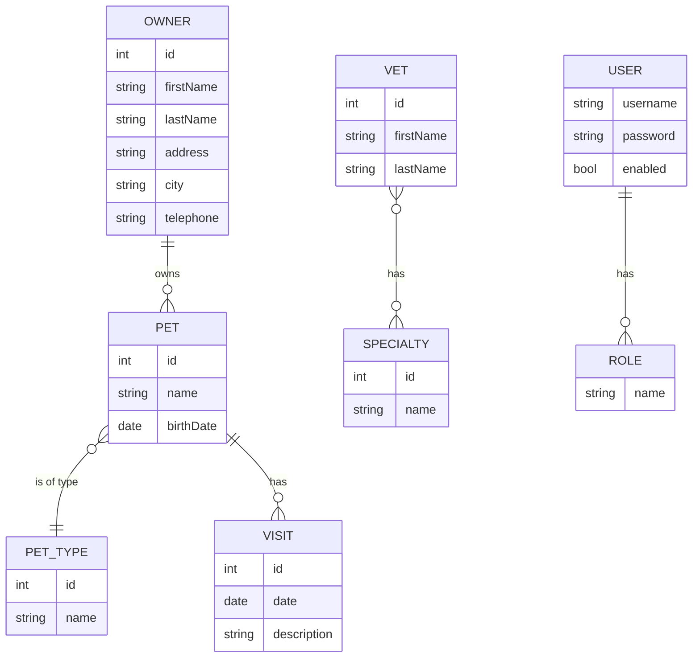

---

## Use Cases

### UC-01 — View All Owners

**Actor**: Owner Admin  
**Goal**: See the complete list of registered pet owners.

**Flow**:
1. User navigates to the Owners page.
2. The system fetches all owners from `GET /api/owners`.
3. Owners are displayed in a table showing Name, Address, City, Telephone, and Pets.

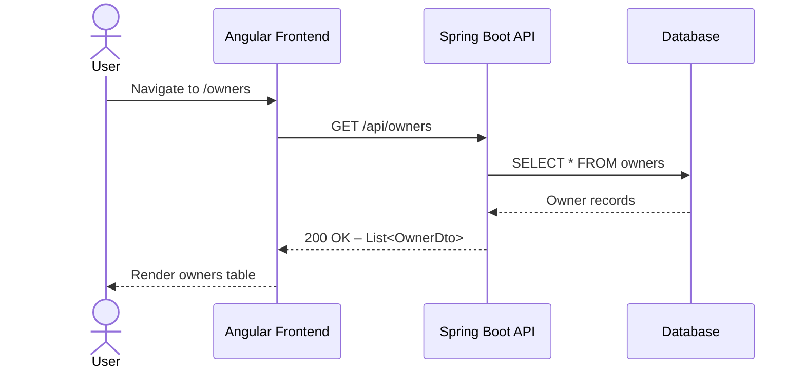

---

### UC-02 — Search Owners by Last Name

**Actor**: Owner Admin  
**Goal**: Quickly find an owner by filtering on last name prefix.

**Flow**:
1. User types a last name prefix in the search box.
2. The system calls `GET /api/owners?lastName={prefix}`.
3. The table updates to show only matching owners.
4. If no owners match, an empty state is shown.

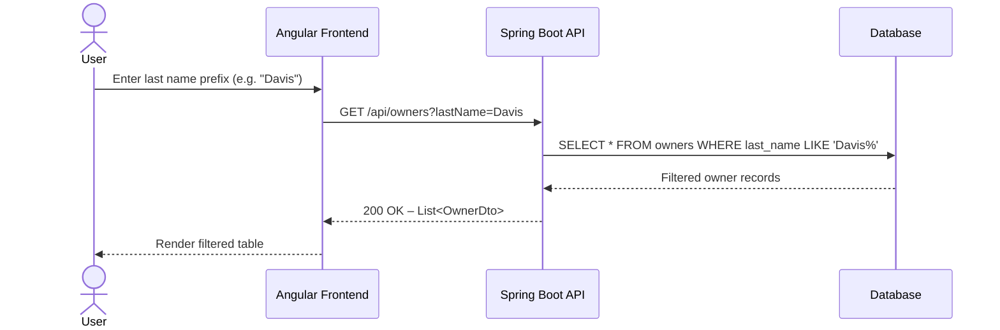

---

### UC-03 — Add a New Owner

**Actor**: Owner Admin  
**Goal**: Register a new pet owner in the system.

**Flow**:
1. User clicks "Add Owner" and fills in the form (first name, last name, address, city, telephone).
2. User submits the form.
3. The system calls `POST /api/owners` with the owner data.
4. On success the system redirects to the new owner's detail page.
5. On validation error the form displays field-level messages.

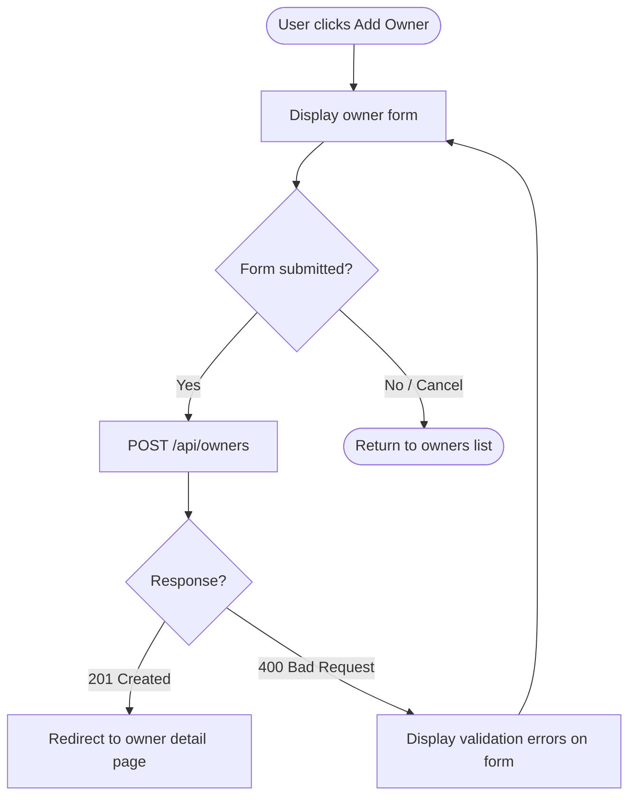

---

### UC-04 — Edit an Owner

**Actor**: Owner Admin  
**Goal**: Update the contact details of an existing owner.

**Flow**:
1. User opens an owner's detail page and clicks "Edit".
2. The form is pre-populated via `GET /api/owners/{ownerId}`.
3. User modifies fields and submits.
4. The system calls `PUT /api/owners/{ownerId}`.
5. On success the owner detail page is refreshed.

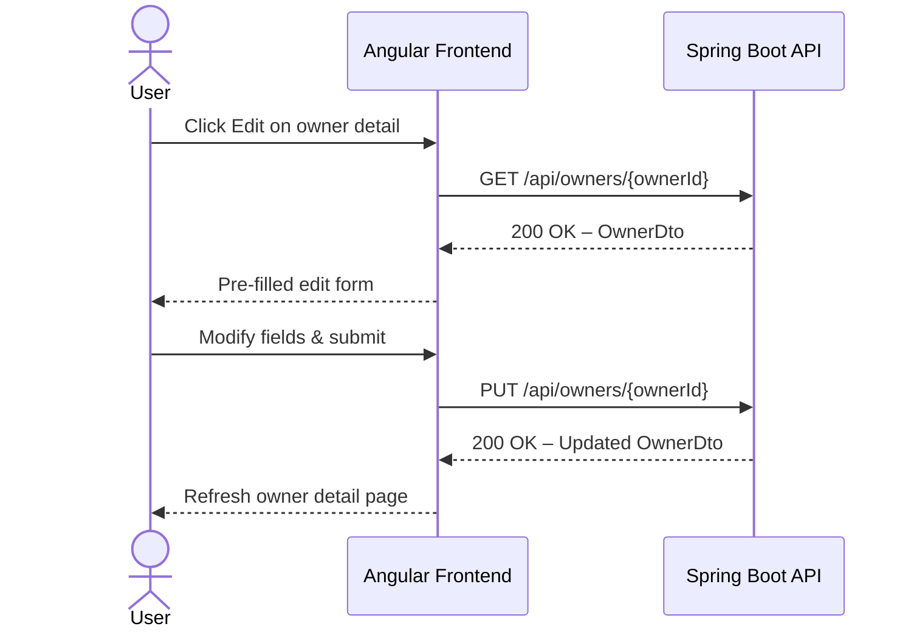

---

### UC-05 — Delete an Owner

**Actor**: Owner Admin  
**Goal**: Remove an owner record from the system.

**Flow**:
1. User clicks "Delete" on an owner.
2. The system calls `DELETE /api/owners/{ownerId}`.
3. On success the user is returned to the owners list.

> **Note**: Deleting an owner cascades to their associated pets and visits.

---

### UC-06 — Add a Pet to an Owner

**Actor**: Owner Admin  
**Goal**: Register a new pet under an existing owner.

**Flow**:
1. From the owner's detail page the user clicks "Add New Pet".
2. The form requires pet name, birth date, and type (dropdown from `GET /api/pettypes`).
3. User submits the form.
4. The system calls `POST /api/owners/{ownerId}/pets`.
5. The owner detail page reloads showing the new pet.

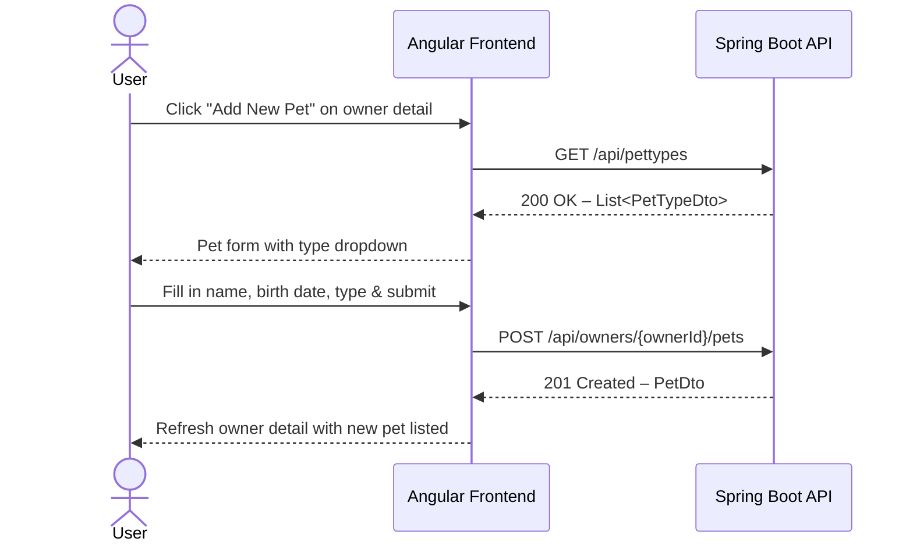

---

### UC-07 — Edit a Pet

**Actor**: Owner Admin  
**Goal**: Update the details of an existing pet.

**Flow**:
1. From the owner detail page the user clicks "Edit Pet".
2. Pet data is loaded via `GET /api/owners/{ownerId}/pets/{petId}`.
3. User updates fields and submits.
4. The system calls `PUT /api/owners/{ownerId}/pets/{petId}`.

---

### UC-08 — Schedule a Visit for a Pet

**Actor**: Owner Admin  
**Goal**: Record a vet visit for a specific pet.

**Flow**:
1. From the owner's detail page, the user clicks "Add Visit" on a pet.
2. User fills in visit date and description.
3. The system calls `POST /api/owners/{ownerId}/pets/{petId}/visits`.
4. The visit appears in the pet's visit history.

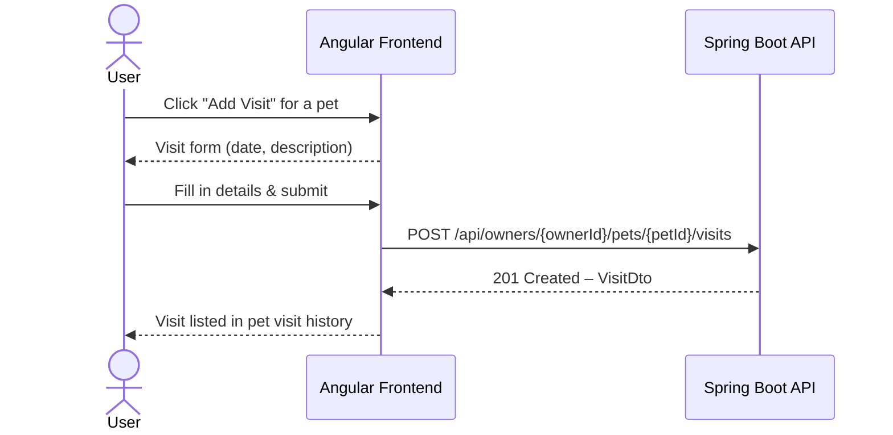

---

### UC-09 — Manage Veterinarians

**Actor**: Vet Admin  
**Goal**: Create, update, and remove veterinarian records.

**Sub-flows**:

| Action | HTTP Call |
|---|---|
| List vets | `GET /api/vets` |
| Add vet | `POST /api/vets` |
| Edit vet | `PUT /api/vets/{vetId}` |
| Delete vet | `DELETE /api/vets/{vetId}` |

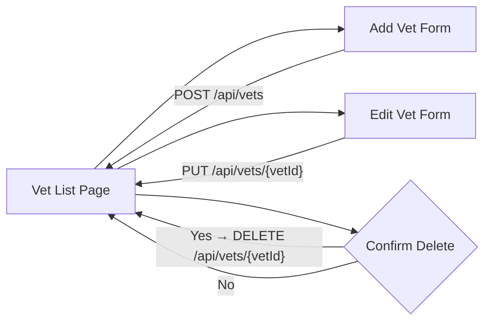

---

### UC-10 — Manage Vet Specialties

**Actor**: Vet Admin  
**Goal**: Maintain the list of medical specialties that can be assigned to vets.

**Sub-flows**:

| Action | HTTP Call |
|---|---|
| List specialties | `GET /api/specialties` |
| Add specialty | `POST /api/specialties` |
| Edit specialty | `PUT /api/specialties/{specialtyId}` |
| Delete specialty | `DELETE /api/specialties/{specialtyId}` |

---

### UC-11 — Manage Pet Types

**Actor**: Vet Admin  
**Goal**: Maintain the catalogue of pet types (e.g., Cat, Dog, Bird).

**Sub-flows**:

| Action | HTTP Call | Access |
|---|---|---|
| List pet types | `GET /api/pettypes` | All roles |
| Add pet type | `POST /api/pettypes` | Vet Admin only |
| Edit pet type | `PUT /api/pettypes/{petTypeId}` | Vet Admin only |
| Delete pet type | `DELETE /api/pettypes/{petTypeId}` | Vet Admin only |

---

### UC-12 — Create a System User

**Actor**: Admin  
**Goal**: Provision a new user account with the appropriate role.

**Flow**:
1. Admin calls `POST /api/users` with username, password, and role(s).
2. Available roles: `ROLE_OWNER_ADMIN`, `ROLE_VET_ADMIN`, `ROLE_ADMIN`.
3. The system stores the account; the new user can immediately log in.

> This endpoint is restricted to `ADMIN` role only.

---

## End-to-End Application Flow

The diagram below shows how a typical day-to-day interaction (registering an owner, adding a pet, and booking a visit) flows across all layers of the system.

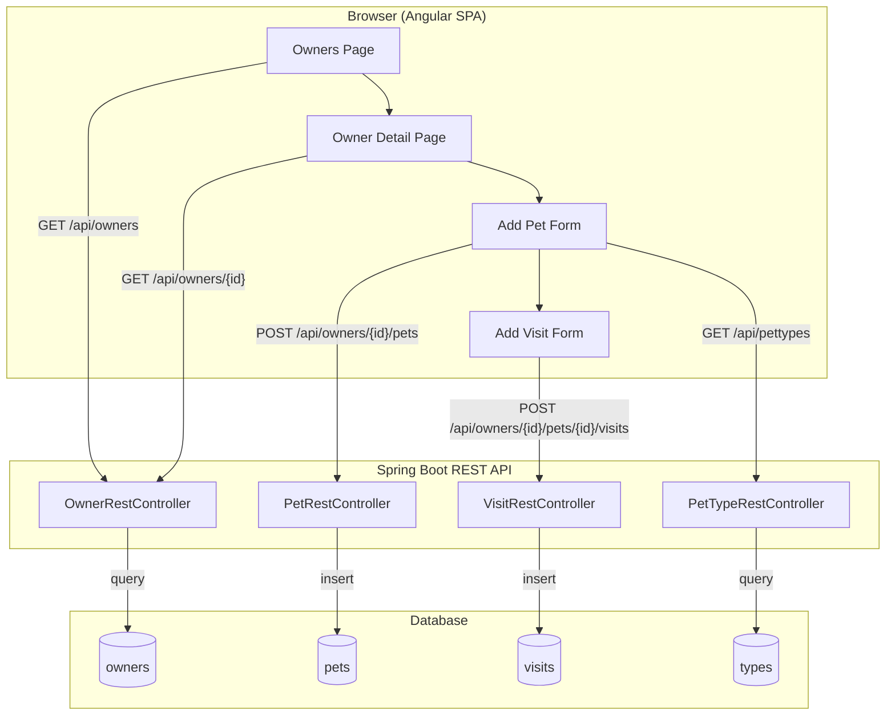

---

## Authentication & Authorization Flow

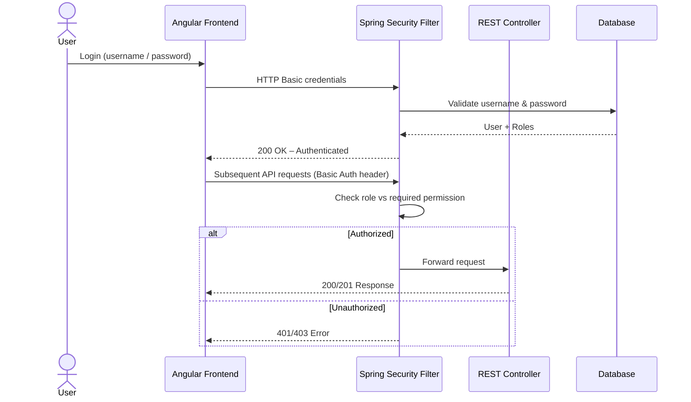

---

## Error Handling Flow

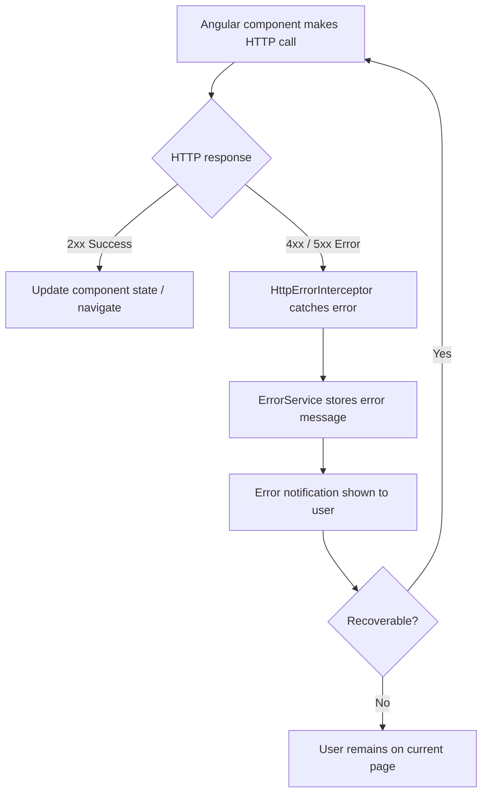

---

## API Summary

| Resource | List | Create | Read | Update | Delete |
|---|---|---|---|---|---|
| Owners | `GET /api/owners` | `POST /api/owners` | `GET /api/owners/{id}` | `PUT /api/owners/{id}` | `DELETE /api/owners/{id}` |
| Owner Pets | — | `POST /api/owners/{id}/pets` | `GET /api/owners/{id}/pets/{petId}` | `PUT /api/owners/{id}/pets/{petId}` | — |
| Owner Pet Visits | — | `POST /api/owners/{id}/pets/{petId}/visits` | — | — | — |
| Pets | `GET /api/pets` | — | `GET /api/pets/{id}` | `PUT /api/pets/{id}` | `DELETE /api/pets/{id}` |
| Pet Types | `GET /api/pettypes` | `POST /api/pettypes` | `GET /api/pettypes/{id}` | `PUT /api/pettypes/{id}` | `DELETE /api/pettypes/{id}` |
| Vets | `GET /api/vets` | `POST /api/vets` | `GET /api/vets/{id}` | `PUT /api/vets/{id}` | `DELETE /api/vets/{id}` |
| Specialties | `GET /api/specialties` | `POST /api/specialties` | `GET /api/specialties/{id}` | `PUT /api/specialties/{id}` | `DELETE /api/specialties/{id}` |
| Visits | `GET /api/visits` | `POST /api/visits` | `GET /api/visits/{id}` | `PUT /api/visits/{id}` | `DELETE /api/visits/{id}` |
| Users | — | `POST /api/users` | — | — | — |
